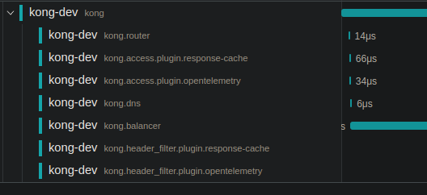

# Kong Response Cache - kong-proxy-cache-advanced enterprise alternative

## Fail fast

An unique feature which is missing even in the [`proxy-cache-advanced`](https://docs.konghq.com/hub/kong-inc/proxy-cache-advanced/configuration/) Kong Enterprise plugin.

Allows to configure a number of fails, after which the connection to the redis intance won't be attempted for a given period of time.

This drastically decreases the impact of redis outages on the QoS (Quality of Service), which under the same conditions would be impacted by the redis timeouts configured.

Ex: A redis connect timeout value of `1000` will effectively add 1 second to every request if redis is unavailable, compared to around `70μs` once the circuit breaker engages.

The number of fails as well as the timeout until the connection is reatempted is configurable.

## Configuration

## Disclaimers

The plugin is based and improves on the <https://github.com/globocom/kong-plugin-proxy-cache> plugin, which is currently outdated (the last commit is 6 years ago at the time of writing) and lacks important redis configuration parameters, which are exposed in the kong-proxy-advanced enterprise plugin.
