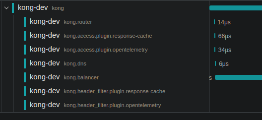

# Kong Response Cache - kong-proxy-cache-advanced enterprise alternative

## Fail fast

An unique feature which is missing even in the [`proxy-cache-advanced`](https://docs.konghq.com/hub/kong-inc/proxy-cache-advanced/configuration/) Kong Enterprise plugin.

Allows to configure a number of fails, after which the connection to the redis intance won't be attempted for a given period of time.

This drastically decreases the impact of redis outages on the QoS (Quality of Service), which under the same conditions would be impacted by the redis timeouts configured.

Ex: A redis connect timeout value of `1000` will effectively add 1 second to every request if redis is unavailable, compared to around `70μs` once the circuit breaker engages.

The number of fails as well as the timeout until the connection is reatempted is configurable.

## Configuration

| Parameter                       | Description                                                                                              | Type          | Default Value                      | Range                 |
|---------------------------------|----------------------------------------------------------------------------------------------------------|---------------|------------------------------------|-----------------------|
| `protocols`                     | The protocols this plugin will run with.                                                                  | Array         |                                    |                       |
| `config.redis.host`             | Hostname of the Redis server.                                                                             | String        |                                    |                       |
| `config.redis.sentinel_master_name` | Name of the sentinel master to connect to.                                                             | String        |                                    |                       |
| `config.redis.sentinel_role`    | Role of the sentinel (either 'master' or 'slave').                                                       | String        | master                             |                       |
| `config.redis.sentinel_addresses` | Addresses of the Redis sentinel servers.                                                                 | Array         |                                    |                       |
| `config.redis.port`             | Port number of the Redis server.                                                                          | Number        | 6379                               | 0 - 65534             |
| `config.redis.circuit_breaker.enabled` | Indicates if the circuit breaker is enabled.                                                        | Boolean       | true                               |                       |
| `config.redis.circuit_breaker.fails_threshold` | Number of failures in the last circuit_breaker.ttl seconds to trigger the circuit breaker.                                        | Number        | 10                                 | 1 - 1000              |
| `config.redis.circuit_breaker.ttl` | Time-to-live (TTL) in seconds for the circuit breaker when engaged.                                                  | Number        | 60                                 | 1 - 86400             |
| `config.redis.ssl.enabled`      | Indicates if SSL is enabled for the Redis connection.                                                    | Boolean       |                                    |                       |
| `config.redis.ssl.verify`       | Indicates if SSL certificate verification is enabled.                                                    | Boolean       |                                    |                       |
| `config.redis.ssl.server_name`  | Server name for SSL verification.                                                                         | String        |                                    |                       |
| `config.redis.timeout.connect`  | Connection timeout in milliseconds.                                                                       | Number        | 200                                | 1 - 5000              |
| `config.redis.timeout.read`     | Read timeout in milliseconds.                                                                             | Number        | 100                                | 1 - 5000              |
| `config.redis.timeout.send`     | Send timeout in milliseconds.                                                                             | Number        | 100                                | 1 - 5000              |
| `config.redis.password`         | Password for the Redis server.                                                                            | String        |                                    |                       |
| `config.redis.username`         | Username for the Redis server.                                                                            | String        |                                    |                       |
| `config.redis.database`         | Database number to use in Redis.                                                                          | Number        | 0                                  |                       |
| `config.redis.max_idle_timeout` | Maximum idle timeout in milliseconds for Redis connections.                                              | Number        | 20000                              |                       |
| `config.redis.pool_size`        | Connection pool size for Redis.                                                                           | Number        | 1000                               |                       |
| `config.response_code`          | Upstream response status codes considered cacheable.                                                     | Array         | [200, 301, 404]                    | 100 - 900             |
| `config.request_method`         | Downstream request methods considered cacheable.                                                         | Array         | ["GET", "HEAD"]                    | "HEAD", "GET", "POST", "PATCH", "PUT" |
| `config.content_type`           | Upstream response content types considered cacheable. The plugin performs an **exact match** against each specified value. | Array         | ["text/plain", "application/json"] |                       |
| `config.cache_ttl`              | TTL, in seconds, of cache entities.                                                                       | Integer       | 300                                | > 0                   |
| `config.cache_control`          | When enabled, respect the Cache-Control behaviors defined in RFC7234.                                     | Boolean       | false                              |                       |
| `config.ignore_uri_case`        | Indicates whether to ignore case when matching URIs for caching.                                          | Boolean       | false                              |                       |
| `config.storage_ttl`            | Number of seconds to keep resources in the storage backend. This value is independent of `cache_ttl` or resource TTLs defined by Cache-Control behaviors. | Integer       | 3600                               | > 0                   |
| `config.vary_query_params`      | Relevant query parameters considered for the cache key. If undefined, all params are taken into consideration. | Array         |                                    |                       |
| `config.vary_headers`           | Relevant headers considered for the cache key. If undefined, none of the headers are taken into consideration. | Array         |                                    |                       |
| `config.response_headers.Age`   | Return cache Age header.                                                                  | Boolean       | true                               |                       |
| `config.response_headers.X-Cache-Status` | Return X-Cache-Status header.                                            | Boolean       | true                               |                       |
| `config.response_headers.X-Cache-Key` | Return X-Cache-Key header.                                                  | Boolean       | true                               |                       |

## Disclaimers

The plugin is based and improves on the <https://github.com/globocom/kong-plugin-proxy-cache> plugin, which is currently outdated (the last commit is 6 years ago at the time of writing) and lacks important redis configuration parameters, which are exposed in the kong-proxy-advanced enterprise plugin.
